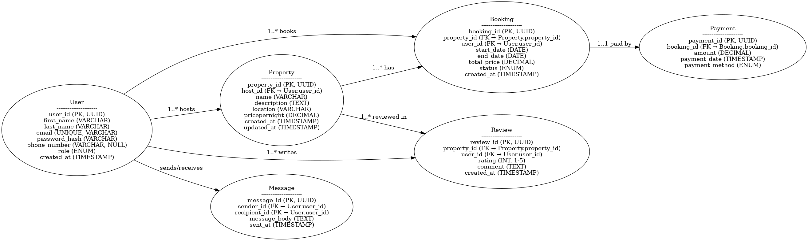

# Database Specification - AirBnB

---

## Entities and Attributes

### User

- user_id (UUID) Primary Key Indexed
- first_name (VARCHAR) Not Null
- last_name (VARCHAR) Not Null
- email (VARCHAR) Unique Not Null
- password_hash (VARCHAR) Not Null
- phone_number (VARCHAR) NULL
- role (ENUM) (guest, host, admin) Not Null
- created_at (TIMESTAMP) Default CURRENT_TIMESTAMP

### Property

- property_id (UUID) Primary Key Indexed
- host_id (UUID) Foreign Key references User(user_id)
- name (VARCHAR) Not Null
- description (TEXT) Not Null
- location (VARCHAR) Not Null
- pricepernight (DECIMAL) Not Null
- created_at (TIMESTAMP) Default CURRENT_TIMESTAMP
- updated_at (TIMESTAMP) ON UPDATE CURRENT_TIMESTAMP

### Booking

- booking_id (UUID) Primary Key Indexed
- property_id (UUID) Foreign Key references Property(property_id)
- user_id (UUID) Foreign Key references User(user_id)
- start_date (DATE) Not Null
- end_date (DATE) Not Null
- total_price (DECIMAL) Not Null
- status (ENUM) (pending, confirmed, canceled) Not Null
- created_at (TIMESTAMP) Default CURRENT_TIMESTAMP

### Payment

- payment_id (UUID) Primary Key Indexed
- booking_id (UUID) Foreign Key references Booking(booking_id)
- amount (DECIMAL) Not Null
- payment_date (TIMESTAMP) Default CURRENT_TIMESTAMP
- payment_method (ENUM) (credit_card, paypal, bank_transfer) Not Null

### Review

- review_id (UUID) Primary Key Indexed
- property_id (UUID) Foreign Key references Property(property_id)
- user_id (UUID) Foreign Key references User(user_id)
- rating (INTEGER) Not Null
- comment (TEXT) Not Null
- comment (TEXT) Not Null
- created_at (TIMESTAMP) Default CURRENT_TIMESTAMP

### Message

- message_id (UUID) Primary Key Indexed
- sender_id (UUID) Foreign Key references User(user_id)
- recipient_id (UUID) Foreign Key references User(user_id)
- message_body (TEXT) Not Null
- sent_at (TIMESTAMP) Default CURRENT_TIMESTAMP

---

## ER Diagram

Using Chen-Crow's Foot hybrid ERD diagram:

### Adjusted ER Diagram - 3NF

